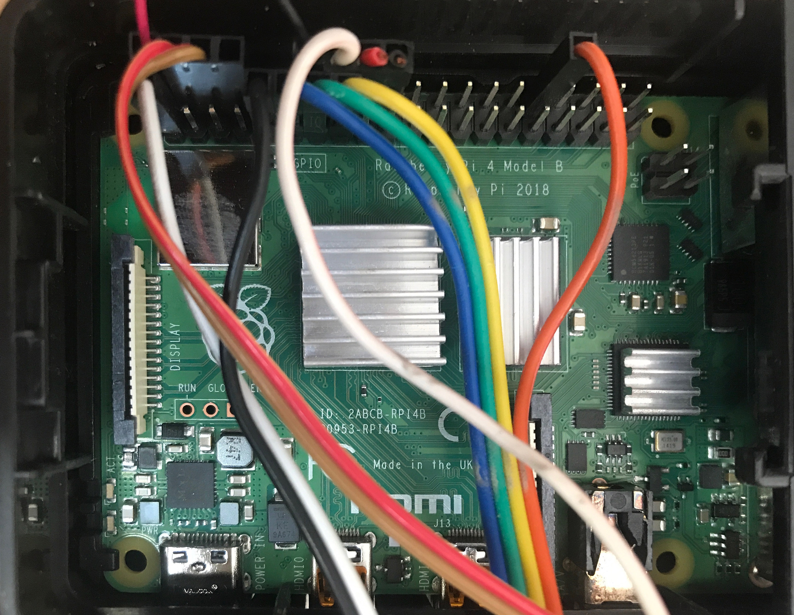

# Wiring of the Raspberry Pi

A brief guide to wiring the Raspberry Pi 4 for Heads-Tails

## Pinouts

### Raspberry Pi GPIO 40-pin header diagram:

GPIO 40-pin header numbering:


## Wiring

### Wiring of the Raspberry Pi in Heads-Tails control board:



## Connections

```
GPIO HEADER PIN		COLOR	DESCRIPTION		DESTINATION
---------------		-----	-----------		-----------
1					RED		+3.3V			ShiftRegisterBoard 1, Voltage Shifter VIN PIN
2					RED		+5.0V			Fan +V
4					WHITE	+5.0V			ShiftRegisterBoard 1, + Terminal Block
6					BROWN	GND				ShiftRegisterBoard 1, - Terminal Block
9					BLACK	GND 			ShiftRegisterBoard 1, Voltage Shifter GND IN PIN
11					BLUE	STROBE			ShiftRegisterBoard 1, STROBE Terminal Block
13					GREEN	DATA			ShiftRegisterBoard 1, DATA Terminal Block
14					BLACK	GND 			Fan GND
15					YELLOW	CLOCK			ShiftRegisterBoard 1, CLOCK Terminal Block
16					WHITE	INTERRUPT		ShiftRegisterBoard 1, ZERO CROSSING Terminal Block
32					ORANGE	PWM				ShiftRegisterBoard 1, HEADLIGHT Terminal Block
```